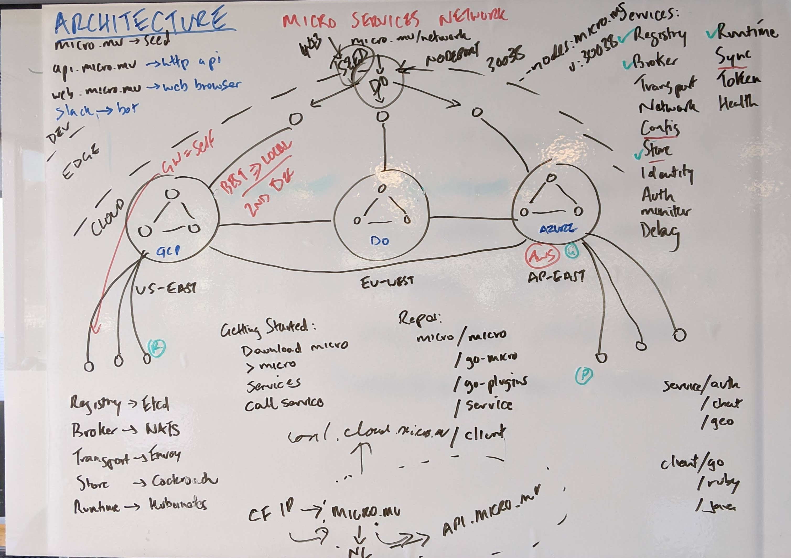

# Platform

The micro platform (M3O) is a cloud based serverless platform for microservices development.

## Overview

This document serves as the design document for our cloud infrastructure and a reference 
point for anyone who wants to understand how it works.

We're operating on all major cloud providers (AWS, Azure, GCP) in a multi-cloud and multi-region 
deployment across US, EU and Asia. We're leveraging DO as a control plane and CloudFlare for 
global load balancing along with KV storage for anything that needs global state.

## Design

The platform exists in the repository [micro/platform](https://github.com/micro/platform) and builds on
the [Micro](https://github.com/micro/micro) runtime.

## Architecture

TODO by @jake

## Features

The features which will be included in the platform

- **Cloud Automation** - Full terraform automation to bootstrap platform
- **Account Management** - GitHub account management via teams
- **Alerting** - Event notification and alerting via email/sms/slack
- **Billing** - Metered billing of services used
- **Dashboard** - A full UX experience via a web dashboard
- **Multi-Cloud** - Ability to manage and deploy services across multiple clouds and regions
- **GitOps** - Source to Running via GitHub actions
- **K8s Native** - Built to run on Kubernetes
- More soon...

## Components

Top down:

### Entrypoints

We serve any environment through 3 global endpoints:

- api.micro.mu - the `micro api` served over https
- web.micro.mu - the `micro web` served over https
- network.micro.mu - the `micro network` served over quic/tunnel

The api is used as the http/json inbound. The web dashboard is used to serve web apps. The network is used to interconnect different regions.

## Runtime

Internally we're running the entire `micro runtime` as single replicas to abstract away the underlying infrastructure.

## Infrastructure

We use managed kubernetes on every cloud provider. Our shared infrastructure for each service is as follows.

- etcd - registry
- nats - broker
- cockroachdb - store

